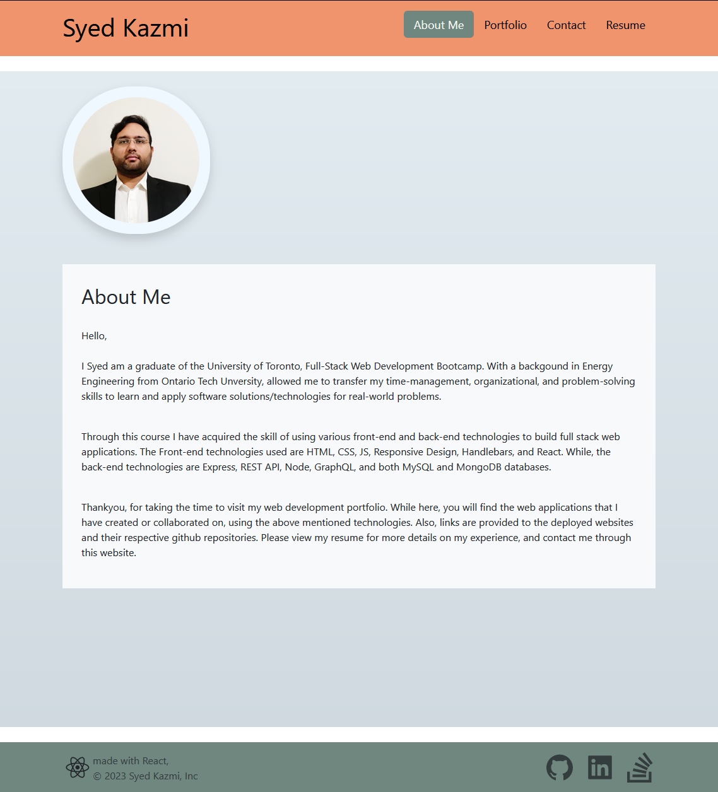

# Full-Stact Web Development - React Portfolio

The Full-Stack Web Development portfolio was created using React and associated libraries to showcase the ability of building a single-page web application.  

## Features

- React + Vite used to build the portfolio web application
- React-router used to handle all endpoints and component renders
- React-Bootstrap used to build the layout and component styling
## Appendix

https://react.dev/learn/writing-markup-with-jsx

https://reactrouter.com/en/6.22.0/components/outlet

https://react-bootstrap.netlify.app/docs/forms/form-control/

https://reactsvgicons.com/

https://coolors.co/ef946c-c4a77d-70877f-454372-2f2963

https://upmostly.com/tutorials/changing-the-background-color-in-react

https://docs.netlify.com/get-started/

## Authors

- [Syed Kazmi](https://github.com/kazmiali123)

## Deployment

Netlify Deployed URL: https://willowy-lollipop-e79ff2.netlify.app/

GitHub Repository: https://github.com/kazmiali123/Full-Stack-Dev-Portfolio

## Demo

